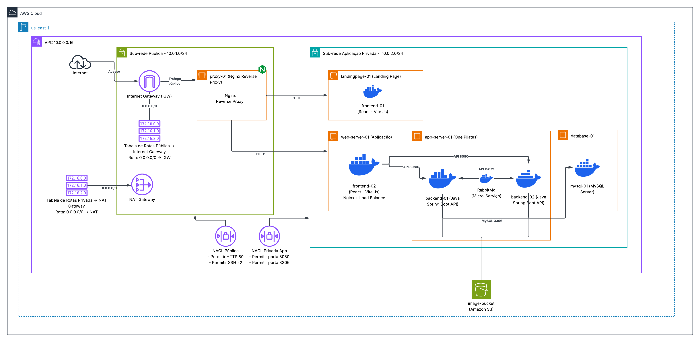

# 🏗️ Infraestrutura AWS — One Pilates

Infraestrutura como Código (IaC) utilizando **Terraform** para provisionar toda a arquitetura de rede e servidores do projeto **One Pilates** na AWS.

---

## 📐 Arquitetura

```
┌─────────────────────────────────────────────────────────────────────────────┐
│                           AWS Cloud (us-east-1)                             │
│                                                                             │
│  ┌─ VPC 10.0.0.0/16 ──────────────────────────────────────────────────────┐ │
│  │                                                                         │ │
│  │  ┌─ Sub-rede Pública 10.0.1.0/24 ──────────────────────────────────┐   │ │
│  │  │                                                                  │   │ │
│  │  │   Internet ──► IGW ──► [ proxy-01 ] ◄── Elastic IP               │   │ │
│  │  │                         Nginx Reverse Proxy                      │   │ │
│  │  │                               │                                  │   │ │
│  │  │                          NAT Gateway                             │   │ │
│  │  └──────────────────────────────────────────────────────────────────┘   │ │
│  │                                  │                                      │ │
│  │  ┌─ Sub-rede Privada 10.0.2.0/24 ─── (Aplicação) ─────────────────┐   │ │
│  │  │                               │                                  │   │ │
│  │  │   [ landingpage-01 ]    [ web-server-01 ]    [ app-server-01 ]   │   │ │
│  │  │   React + Vite (TS)     React + Vite (JS)    Spring Boot + MQ    │   │ │
│  │  │   Landing Page          Sistema Gestão        API REST            │   │ │
│  │  │                                                     │            │   │ │
│  │  │                                              [ database-01 ]     │   │ │
│  │  │                                              MySQL 8.0 Docker    │   │ │
│  │  └──────────────────────────────────────────────────────────────────┘   │ │
│  └─────────────────────────────────────────────────────────────────────────┘ │
│                                                                             │
│                          [ image-bucket ] Amazon S3                          │
└─────────────────────────────────────────────────────────────────────────────┘
```

---

## 📁 Estrutura dos Arquivos

| Arquivo | Descrição |
|---------|-----------|
| `provider.tf` | Configuração do provider AWS e versão do Terraform |
| `variables.tf` | Variáveis centralizadas (região, AMI, tipos de instância, IP SSH) |
| `vpc.tf` | VPC principal `10.0.0.0/16` com DNS habilitado |
| `subnets.tf` | Sub-rede pública `10.0.1.0/24` e privada `10.0.2.0/24` |
| `gateways.tf` | Internet Gateway + NAT Gateway (com Elastic IP) |
| `route_tables.tf` | Tabelas de rotas: pública → IGW, privada → NAT |
| `nacl.tf` | Network ACLs para controle de tráfego nas sub-redes |
| `security_groups.tf` | Security Groups para cada instância EC2 |
| `ec2.tf` | 5 instâncias EC2 com `user_data` para setup automático |
| `s3.tf` | Bucket S3 para imagens + IAM Role para acesso das EC2 |
| `outputs.tf` | Outputs com IPs, IDs e ARNs dos recursos criados |
| `.gitignore` | Ignora `.terraform/`, `tfplan` e arquivos sensíveis |

---

## 🖥️ Instâncias EC2

### proxy-01 — Nginx Reverse Proxy
- **Sub-rede:** Pública (`10.0.1.0/24`)
- **Função:** Ponto de entrada da aplicação, recebe todo o tráfego HTTP/HTTPS da Internet
- **Elastic IP:** Sim (IP público fixo)
- **Roteamento:**
  - `/` → landingpage-01 (porta 5173)
  - `/app/` → web-server-01 (porta 5173)
  - `/api/` → app-server-01 (porta 8080)

### landingpage-01 — Landing Page
- **Sub-rede:** Privada (`10.0.2.0/24`)
- **Repositório:** [One-Pilates/LandingPage](https://github.com/One-Pilates/LandingPage)
- **Stack:** React 18, TypeScript, Vite, Tailwind CSS, Framer Motion
- **Setup automático:** Instala Node.js 18 → `git clone` → `npm install` → `npm run dev`
- **Porta:** 5173

### web-server-01 — Sistema de Gestão (Frontend)
- **Sub-rede:** Privada (`10.0.2.0/24`)
- **Repositório:** [One-Pilates/Frontend](https://github.com/One-Pilates/Frontend)
- **Stack:** React 19, Vite, SCSS, FullCalendar, HighCharts, Axios
- **Setup automático:** Instala Node.js 18 → `git clone` → `npm install` → `npm run dev`
- **Porta:** 5173

### app-server-01 — Backend API + Micro-serviços
- **Sub-rede:** Privada (`10.0.2.0/24`)
- **Repositório:** [One-Pilates/Backend](https://github.com/One-Pilates/Backend) (branch `development`)
- **Stack:** Java 17, Spring Boot 3, Spring Security (JWT), Maven, RabbitMQ
- **Setup automático:** Instala Java 17 + Maven → inicia RabbitMQ (Docker) → `git clone` → configura `application.properties` → `mvn clean package` → `java -jar`
- **Porta:** 8080 (API), 5672 (RabbitMQ), 15672 (RabbitMQ UI)

### database-01 — Banco de Dados
- **Sub-rede:** Privada (`10.0.2.0/24`)
- **Stack:** MySQL 8.0 (via Docker)
- **Setup automático:** Instala Docker → inicia container MySQL com volume persistente
- **Porta:** 3306
- **Database:** `onepilates`

---

## 🔒 Segurança

### Network ACLs (NACLs)

| NACL | Regras de Entrada |
|------|-------------------|
| **Pública** | HTTP (80), HTTPS (443), SSH (22), Portas efêmeras (1024-65535) |
| **Privada App** | HTTP (80) do proxy, API (8080), MySQL (3306) interno, RabbitMQ (5672/15672) interno, SSH (22) do proxy, Portas efêmeras |

### Security Groups (encadeados)

O tráfego flui de forma controlada entre os security groups:

```
Internet → [sg-proxy] → [sg-landingpage]
                       → [sg-webserver]
                       → [sg-appserver] → [sg-database]
```

| Security Group | Portas Permitidas | Origem |
|----------------|-------------------|--------|
| `sg-proxy` | 80, 443, 22 | Internet (0.0.0.0/0), SSH restrito |
| `sg-landingpage` | 80, 5173, 22 | Apenas do sg-proxy |
| `sg-webserver` | 80, 5173, 22 | Apenas do sg-proxy |
| `sg-appserver` | 8080, 5672, 15672, 22 | sg-webserver, sg-proxy, self |
| `sg-database` | 3306, 22 | Apenas do sg-appserver, SSH do sg-proxy |

### Tabelas de Rotas

| Tabela | Destino | Alvo |
|--------|---------|------|
| Pública | `0.0.0.0/0` | Internet Gateway |
| Privada | `0.0.0.0/0` | NAT Gateway |

---

## ☁️ Amazon S3

- **Bucket:** `onepilates-image-bucket`
- **Uso:** Armazenamento de imagens da aplicação
- **Segurança:**
  - Acesso público bloqueado
  - Criptografia AES-256 (server-side)
  - Versionamento habilitado
- **Acesso:** Via IAM Role atribuída ao `app-server-01`

---

## 🚀 Como Usar

### Pré-requisitos

- [Terraform](https://www.terraform.io/downloads) >= 1.0
- Credenciais AWS configuradas (via `aws configure` ou variáveis de ambiente)
- Key Pair AWS criado na região `us-east-1`

### Configuração

Edite o arquivo `variables.tf` com seus valores:

```hcl
# Seu IP para acesso SSH (obtenha em https://meuip.com.br)
variable "meu_ip" {
  default = "SEU_IP_AQUI/32"
}

# Nome do seu Key Pair AWS
variable "key_name" {
  default = "sua-key-pair"
}
```

### Comandos

```bash
# 1. Inicializar o Terraform (baixa o provider AWS)
terraform init

# 2. Validar a configuração
terraform validate

# 3. Visualizar o plano (dry run - não cria nada)
terraform plan

# 4. Aplicar a infraestrutura (cria os recursos na AWS)
terraform apply

# 5. Ver os outputs (IPs, IDs)
terraform output

# 6. Destruir tudo (quando não precisar mais)
terraform destroy
```

### Credenciais AWS Academy (Learner Lab)

Se estiver usando o AWS Academy, configure as credenciais temporárias:

```powershell
$env:AWS_ACCESS_KEY_ID="seu_access_key"
$env:AWS_SECRET_ACCESS_KEY="seu_secret_key"
$env:AWS_SESSION_TOKEN="seu_session_token"
```

---

## 📊 Outputs

Após o `terraform apply`, os seguintes valores são exibidos:

| Output | Descrição |
|--------|-----------|
| `proxy_01_public_ip` | IP público do proxy (acesso via navegador) |
| `proxy_01_private_ip` | IP privado do proxy |
| `landingpage_01_private_ip` | IP privado da landing page |
| `webserver_01_private_ip` | IP privado do frontend |
| `appserver_01_private_ip` | IP privado do backend |
| `database_01_private_ip` | IP privado do MySQL |
| `s3_image_bucket_name` | Nome do bucket S3 |

---

## ⚠️ Observações Importantes

1. **Senha do MySQL** está hardcoded no `user_data` como exemplo. Em produção, utilize o [AWS Secrets Manager](https://aws.amazon.com/secrets-manager/).

2. **Vite em modo dev** — As instâncias de frontend rodam `npm run dev`. Para produção, configure `npm run build` + Nginx servindo a pasta `dist/`.

3. **Key Pair** — Crie o Key Pair no console AWS antes de aplicar o Terraform, e ajuste o nome em `variables.tf`.

4. **Custos** — Ao terminar de usar, execute `terraform destroy` para evitar cobranças.

5. **Logs** — Os logs de setup estão em `/var/log/user-data.log` em cada instância.

---

## 🛠️ Tecnologias

| Tecnologia | Versão | Uso |
|------------|--------|-----|
| Terraform | >= 1.0 | Infraestrutura como Código |
| AWS Provider | ~> 5.0 | Provisionamento na AWS |
| Ubuntu | 22.04 LTS | Sistema operacional das EC2 |
| Node.js | 18 LTS | Runtime dos frontends |
| Java | 17 (OpenJDK) | Runtime do backend |
| Maven | 3.8+ | Build do backend |
| Docker | Latest | Containers (MySQL, RabbitMQ) |
| MySQL | 8.0 | Banco de dados |
| RabbitMQ | 3.12 | Fila de mensagens |
| Nginx | Latest | Reverse proxy |

---

## 👥 Projeto

**One Pilates** — Projeto de Extensão SPTech  
Sistema de gerenciamento de agendamentos para estúdio de Pilates.

---

## 🗺️ Diagrama da Arquitetura


